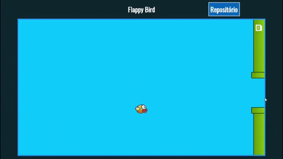

# flappyBird-js 
Essa é uma versão mais simples do jogo Flappy Bird, que desenvolvi utilizando somente HTML, CSS e Javascript.  
This is a simpler version of the game Flappy Bird, using only HTML, CSS and Javascript
  

## Objetivo do projeto / The project's objective :dart:
Meu objetivo ao desenvolver esse projeto foi principalmente colocar em prática meus conhecimentos na linguagem Javascript. Eu adorei desenvolvê-lo, e também gostei muito do resultado final!  
I've developed it with the aim of practicing my Javascript skills, I loved developing it, and the final result too! 

## Resultado final / Final result :arrow_forward: 
Você pode ver o resultado final desse projeto clicando aqui: https://tiagodiass.github.io/flappyBird-js  
You can see it running clicking on the link above.
